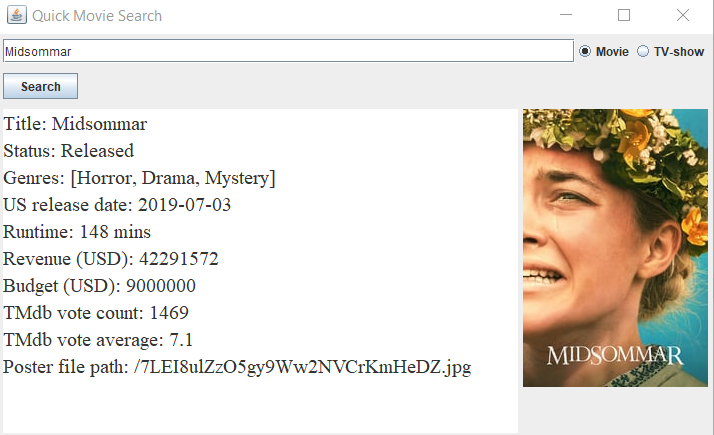

## quickquerytmdb
Small library for basic queries on The Movie Database (themoviedb.org)

To get an API-Key, read this:  
https://developers.themoviedb.org/3/getting-started/introduction
# Features
- Get movie details (Title, Genre, Release date, Runtime ...)
- Get tv-show details (Title, Genre, Number of seasons, Last air date ...)
- Get movie/tv-show poster
- Get collection of movies based on query
- Get collection of tv-shows based on query

# How-to
Note that this library can't be used without an API-Key. Use the link above to get one.

## Searching for specific movies/TV-shows

To search for a specific movie, simply create a MovieDataRetriever object, pass your API-Key in the constructor and call the searchExact method. A few examples on how it works can be seen below.  

```Java
MovieDataRetriever retriever = new MovieDataRetriever("<YOUR_API_KEY_HERE>");
Movie someMovie = retriever.searchExact("<EXACT_MOVIE_TITLE_HERE>");
```

The searchExact Method returns the actual data. More specifically, it returns an immutable Movie object with methods to access the data. Calling the overridden toString() method returns the String representation of the Movie object. If we search for "Hereditary", this representation looks like this

```
Title: Hereditary
Status: Released
Genres: [Horror, Mystery, Thriller]
US release date: 2018-06-07
Runtime: 127 mins
Revenue (USD): 79336821
Budget (USD): 10000000
TMdb vote count: 4076
TMdb vote average: 7.1
Poster file path: /lHV8HHlhwNup2VbpiACtlKzaGIQ.jpg
```

Which is just a summary of all fields containing movie data in the Movie class. It's also possible to access the fields separately (using getters).

Note that searching for a TV-show using the MovieDataRetriever will **not** work. Use the TvDataRetriever class for TV-shows.

```java
TvShowDataRetriever retriever = new TvShowDataRetriever("YOUR_API_KEY_HERE");
TvShow show = retriever.searchExact("EXACT_SHOW_TITLE_HERE");
```

Also note that TvShows do not have the same fields as movies.

For queries using the Retriever constructors, the search term (title of the movie/show) has to be **exact**. The searchExact method isn't case-sensitive however, so the following queries would return the same movie.

```java
MovieDataRetriever retriever = new MovieDataRetriever("Hereditary");
retriever.searchExact("hereditary");
retriever.searchExact("heReDitaRy");
retriever.searchExact("HEREDITARY");
```

## Non-exact search

Using a query string, it is possible to conduct non exact queries. Use the searchByQuery method for this.
```
public List<Movie> searchByQuery(String query)
```

The method returns a list of Movie objects based on the query string.  

An example query looks like this  
```java
MovieDataRetriever retriever = new MovieDataRetriever("YOUR_API_KEY_HERE);
List<Movie> movies = retriever.searchByQuery("QUERY_HERE");
```

Which would return a maximum of 20 movies based on the given query. 

The same process can be repeated for TV-shows

```java
TvShowDataRetriever retriever = new TvShowDataRetriever("YOUR_API_KEY_HERE);
List<TvShow> tvShows = retriever.searchByQuery("QUERY_HERE");
```

# Example client with GUI    
  

## Links
- Google gson library (required to convert JSON files into Java objects): https://github.com/google/gson
- themoviedb.org API (Version 3): https://www.themoviedb.org/documentation/api
